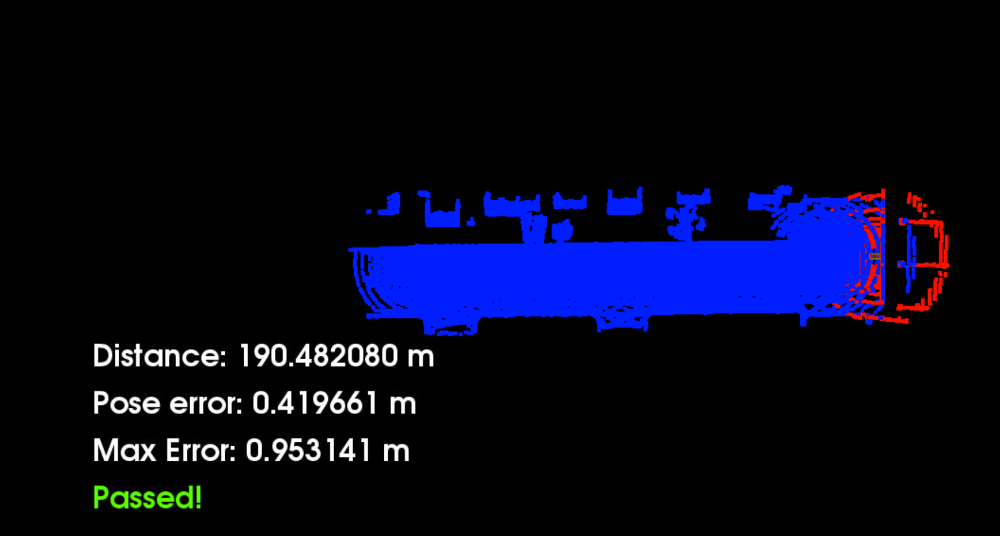
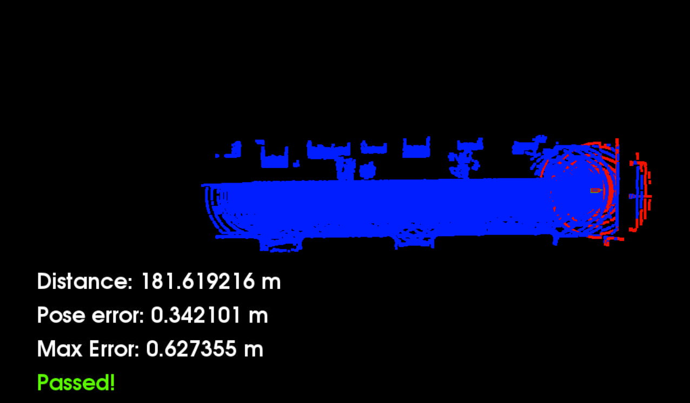

# Self Driving Car Localization

## Passing criteria
Drive the simulated car with LIDAR scanning while localizing with maximum 1.2 m error (with respect to the ground truth) at least 170 m.

## ICP Approach
Passed results were achieved when iterations = 30, leaf size = 1, max correspondance distance = 2.0.

## NDT Approach
Passed results were achieved when iterations = 100, leaf size = 1, resolution = 5.

